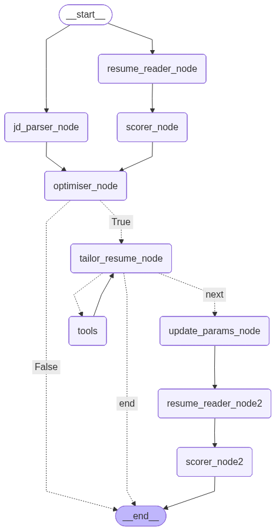

# Tailor Resume

Tailor Resume is an AI-powered system designed to optimize LaTeX resumes for specific job descriptions, increasing the likelihood of passing through Applicant Tracking Systems (ATS) and catching the eye of recruiters. It leverages a sophisticated LangGraph workflow to analyze job descriptions, score resumes, and iteratively tailor content while maintaining the structural integrity of LaTeX documents.

## Features

- **Automated JD Analysis**: Extracts key requirements, tech stacks, and responsibilities from job descriptions.
- **Resume Scoring**: Evaluates the match between a resume and a JD on a scale of 1-100, focusing on skills, experience, and achievements.
- **Intelligent Tailoring**: Suggests and implements realistic optimizations (rewording, keyword alignment) without hallucinating experience.
- **LaTeX Integration**: Directly reads `.tex` files and compiles tailored resumes into PDFs using a dedicated MCP (Model Context Protocol) server.
- **Iterative Optimization**: Uses a feedback loop to update the resume and re-score it until the best possible match is achieved.
- **Browser Extension**: A convenient popup interface to trigger the tailoring process and view score improvements.

## Architecture

The project is built with a modular architecture:

### Workflow Diagram


- **Workflow (`/workflow`)**: A LangGraph-based state machine that orchestrates the tailoring process:
  - `jd_parser_node` $\rightarrow$ `resume_reader_node` $\rightarrow$ `scorer_node` $\rightarrow$ `optimiser_node` $\rightarrow$ `tailor_resume_node` $\rightarrow$ `tools` (MCP) $\rightarrow$ `scorer_node` (Final validation).
- **MCP Server (`/MCP`)**: A FastMCP server providing tools for reading LaTeX files and compiling them to PDF via `pdflatex`.
- **Backend (`/Backend`)**: A FastAPI server that exposes the workflow as an API.
- **Frontend (`/extension`)**: A Chrome extension for a seamless user experience.

## Tech Stack

- **Orchestration**: LangGraph, LangChain
- **LLM**: Gemma 4 (via Ollama)
- **API**: FastAPI
- **Tools**: Model Context Protocol (MCP), FastMCP
- **Document Processing**: LaTeX (`pdflatex`)
- **Frontend**: JavaScript, CSS, HTML (Chrome Extension)

## Installation & Setup

### Prerequisites
- Python 3.12+
- [Ollama](https://ollama.ai/) with `gemma4:31b-cloud` model
- TeX Live (for `pdflatex` command)
- `uv` package manager

### Setup
1. **Clone the repository**:
   ```bash
   git clone https://github.com/pankaj-2708/Resume-tailor-agent
   cd tailor-resume
   ```

2. **Install dependencies**:
   ```bash
   uv sync
   ```

3. **Environment Configuration**:
   Create a `.env` file in the root directory with necessary API keys and configurations.

4. **Start the Backend**:
   ```bash
   python Backend/main.py
   ```

6. **Install the Extension**:
   - Load the `extension` folder as an unpacked extension in Chrome (`chrome://extensions`).

## Workflow Process

1. **JD Parsing**: The system analyzes the provided job description to identify the ideal candidate profile.
2. **Initial Scoring**: The current LaTeX resume is read and scored against the parsed JD.
3. **Optimization Planning**: An optimizer identifies gaps and suggests specific, grounded changes.
4. **Tailoring**: An AI agent rewrites relevant sections of the LaTeX code.
5. **Compilation & Validation**: The updated LaTeX is compiled to PDF via the MCP server, and a final score is generated to quantify the improvement.

---
